# lab2-sql-asesinato-andersonrua1508

## Datos

* **Detective**: Anderson Rua
* **Correo**: anderson.rua@udea.edu.co
* **Usuario GitHub**: andersonrua1508

## Resumen del caso

Se investigó el asesinato ocurrido el 2018-01-15 en SQL City. A través de una serie de consultas a la base de datos se logró identificar primero a Jeremy Bowers como el ejecutor material del crimen, y posteriormente a Miranda Priestly como el cerebro detrás de todo el plan.

## Bitácora de investigación

### Query 1

```sql
SELECT *
FROM crime_scene_report
WHERE date = 20180115
  AND city = 'SQL City'
  AND type = 'murder';
```

**Evidencia**

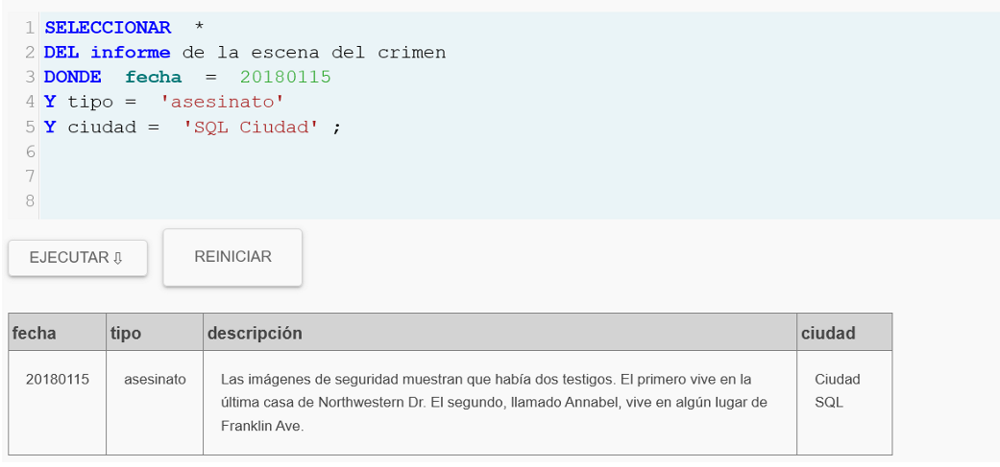

> Conclusión: hay 2 testigos; uno vive en la última casa de Northwestern Dr; el otro es Annabel en Franklin Ave.

### Query 2

```sql
SELECT *
FROM person
WHERE address_street_name = 'Northwestern Dr'
ORDER BY address_number DESC
LIMIT 1;
```

**Evidencia**

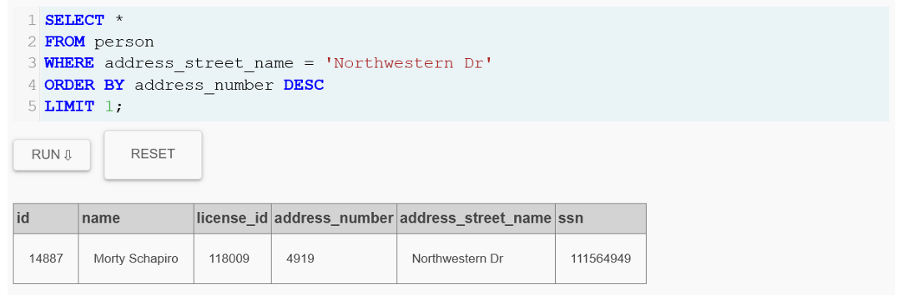

> Conclusión: el testigo 1 es Morty Schapiro (id 14887).

### Query 3

```sql
SELECT *
FROM person
WHERE name LIKE '%Annabel%'
  AND address_street_name = 'Franklin Ave';
```

**Evidencia**

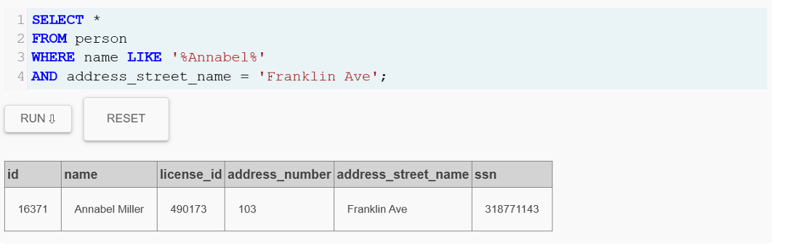

> Conclusión: el testigo 2 es Annabel Miller (id 16371).

### Query 4

```sql
SELECT *
FROM interview
WHERE person_id = 14887;
```

**Evidencia**

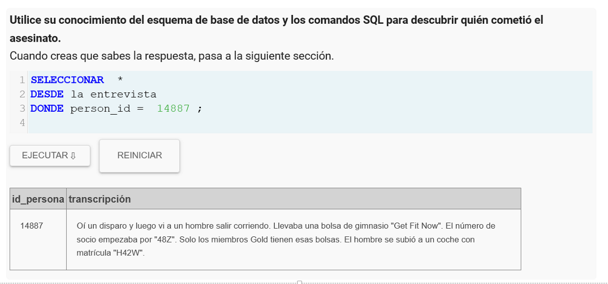

> Conclusión: vio a un hombre con bolsa “Get Fit Now”, miembro GOLD, id empieza por “48Z”, y placa contiene “H42W”.

### Query 5

```sql
SELECT *
FROM interview
WHERE person_id = 16371;
```

**Evidencia**

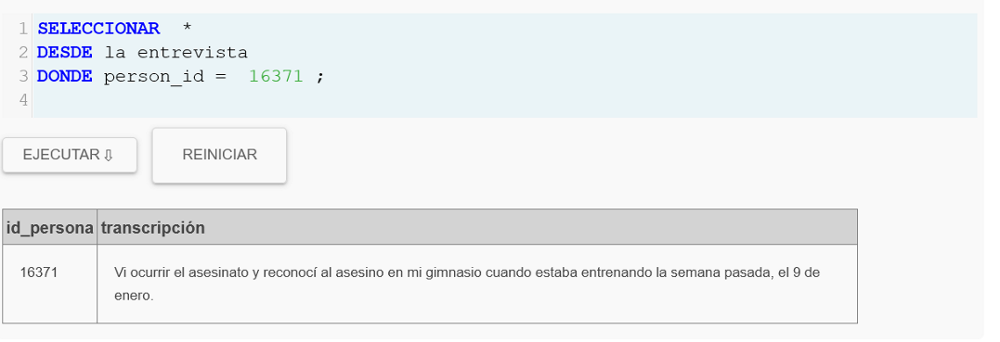

> Conclusión: reconoció al asesino en su gimnasio el 9 de enero.

### Query 6

```sql
SELECT *
FROM get_fit_now_member
WHERE membership_status = 'gold'
  AND id LIKE '48Z%';
```

**Evidencia**

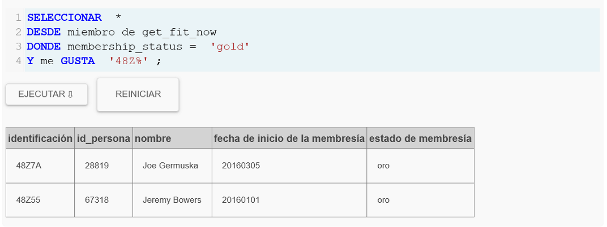

> Conclusión: sospechosos: 48Z7A (Joe Germuska, person_id 28819) y 48Z55 (Jeremy Bowers, person_id 67318).

### Query 7

```sql
SELECT *
FROM drivers_license
WHERE plate_number LIKE '%H42W%';
```

**Evidencia**

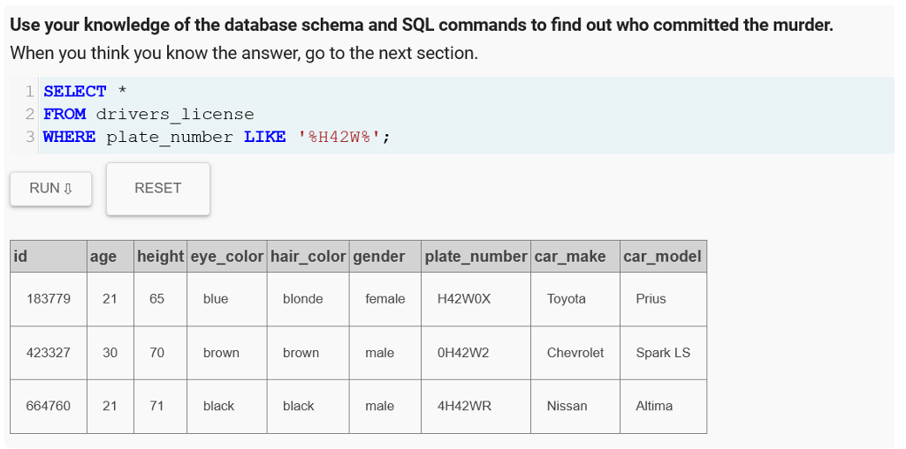

> Conclusión: aparecen 3 licencias candidatas por placa parcial.

### Query 8

```sql
SELECT p.id, p.name, dl.id AS license_db_id, dl.plate_number, dl.car_make, dl.car_model
FROM person p
JOIN drivers_license dl ON dl.id = p.license_id
WHERE p.id IN (28819, 67318);
```

**Evidencia**

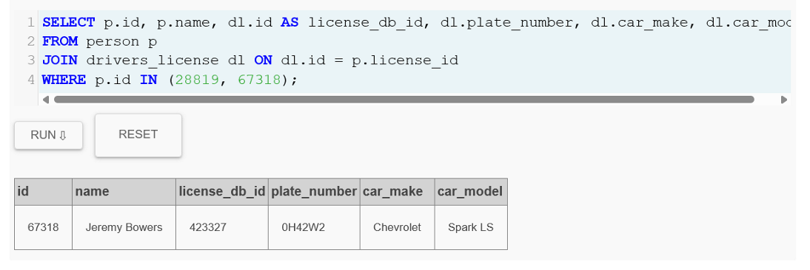

> Conclusión: Jeremy Bowers coincide con la placa 0H42W2.

### Query 9

```sql
SELECT *
FROM get_fit_now_check_in
WHERE check_in_date = 20180109
  AND membership_id IN ('48Z7A', '48Z55');
```

**Evidencia**

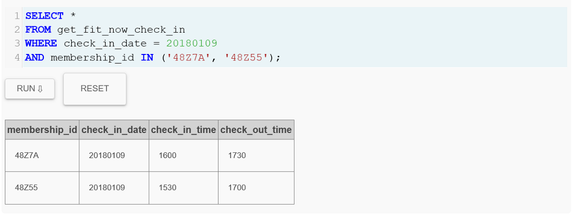

> Conclusión: ambos estuvieron ese día; pero por placa el asesino es Jeremy.

### Query 10

```sql
INSERT INTO solution VALUES (1, 'Jeremy Bowers');
SELECT value FROM solution;
```

**Evidencia**

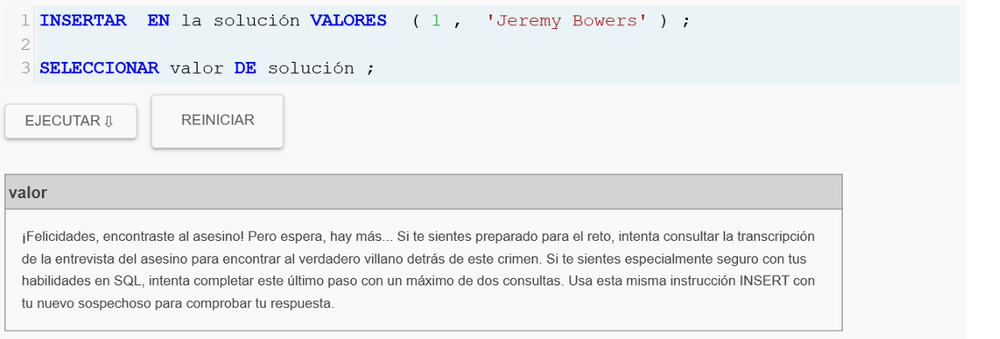

> Conclusión: confirma el asesino y pide buscar al “cerebro” detrás.

### Query 11

```sql
SELECT *
FROM interview
WHERE person_id = 67318;
```

**Evidencia**

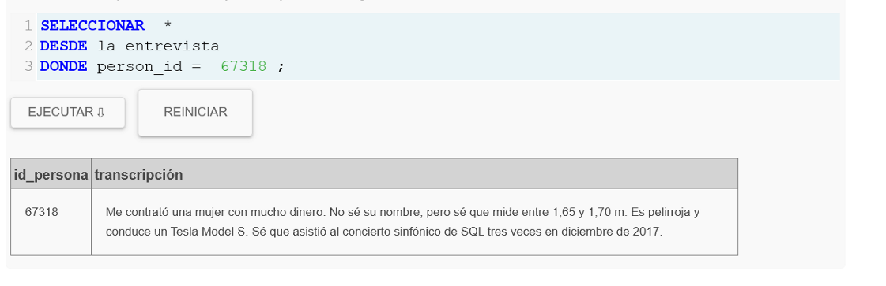

> Conclusión: fue contratado por mujer con mucho dinero; mide 65–67 pulgadas, pelirroja, Tesla Model S; asistió 3 veces al SQL Symphony Concert en dic-2017.

### Query 12

```sql
SELECT *
FROM drivers_license
WHERE gender = 'female'
  AND hair_color = 'red'
  AND height BETWEEN 65 AND 67
  AND car_make = 'Tesla'
  AND car_model = 'Model S';
```

**Evidencia**

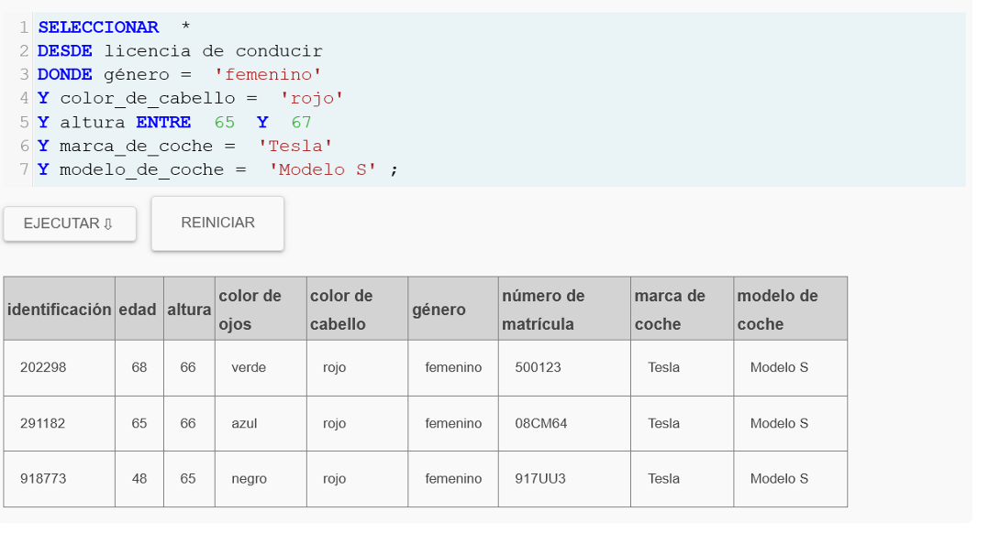

> Conclusión: salen 3 candidatas (ids de licencia: 202298, 291182, 918773).

### Query 13

```sql
SELECT person_id, COUNT(*) AS veces
FROM facebook_event_checkin
WHERE event_name = 'SQL Symphony Concert'
  AND date LIKE '201712%'
GROUP BY person_id
HAVING COUNT(*) >= 3;
```

**Evidencia**

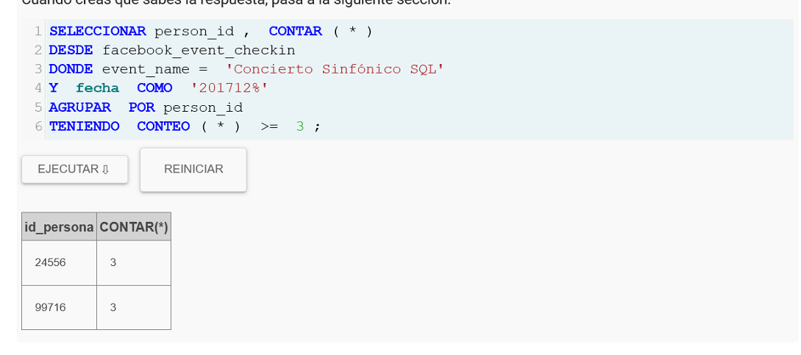

> Conclusión: person_id 24556 y 99716 fueron 3 veces.

### Query 14

```sql
SELECT *
FROM person
WHERE id IN (24556, 99716);
```

**Evidencia**

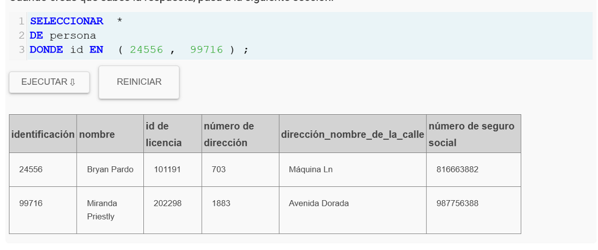

> Conclusión: Bryan Pardo (24556) y Miranda Priestly (99716). Solo Miranda encaja con la licencia 202298 (de Query 12).

### Query 15

```sql
INSERT INTO solution VALUES (1, 'Miranda Priestly');
SELECT value FROM solution;
```

**Evidencia**

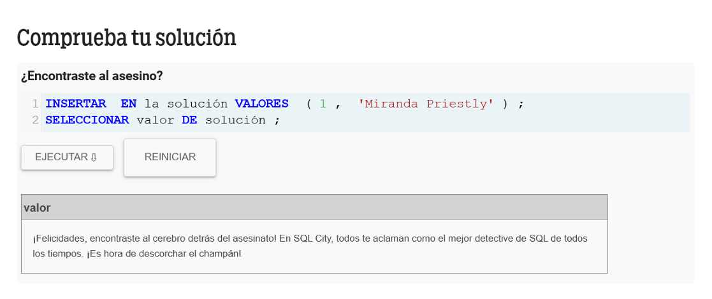

> Conclusión: confirma que ella es el “cerebro” detrás del crimen.

## Conclusión final

* **Asesino (ejecutor):** Jeremy Bowers
* **Cerebro detrás:** Miranda Priestly